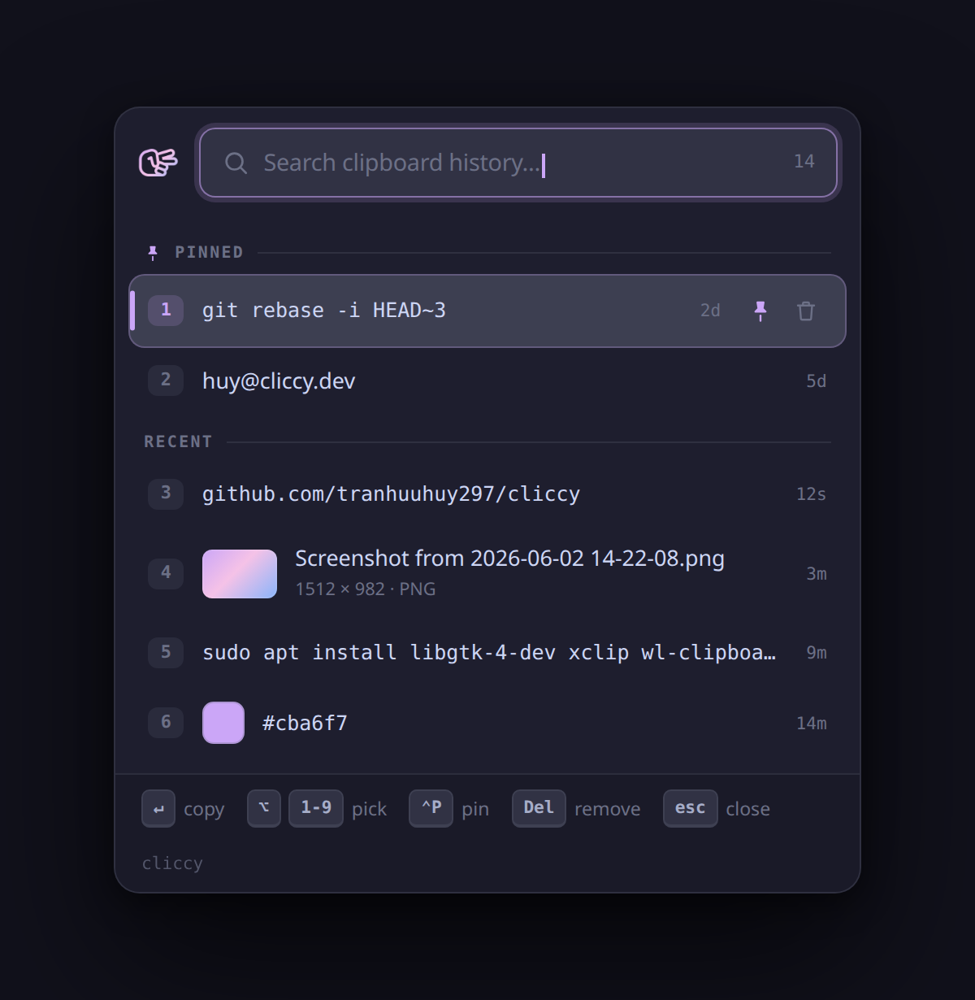

# Cliccy

A lightweight clipboard history manager for Linux — a Maccy-style popup, built
with **Rust + GTK4**. Works on X11 and Wayland (tested: Ubuntu 22.04+).

## Demo

<p align="center">
  
</p>


## Features

- Resident daemon that records what you copy — text **and PNG images**
- Fast type-to-search popup with full keyboard control (image thumbnails inline)
- Pin snippets (`Ctrl+P`, never expire); delete one (`Delete`) or clear all (`cliccy clear`)
- SQLite-backed, capped at 20 unpinned entries (pinned never expire)
- Top-bar tray icon: left-click to open, right-click for the menu — which lists
  your top 3 pinned and top 3 recent entries for one-click copy without opening
  the popup, plus open / clear-history / quit. The popup is a normal window (it
  shows a dock entry while open) so GNOME maps and focuses it reliably every time
- Single small binary, dark Catppuccin theme

## Requirements

- Rust (stable) + Cargo, and GTK4 headers
- Clipboard CLI tools: `xclip` (primary) and `wl-clipboard` (pure-Wayland fallback)
- SQLite is bundled.
- Tray icon needs a StatusNotifier host — GNOME's AppIndicator extension, which
  Ubuntu 22.04+ enables by default. Without it the icon just won't appear; the
  hotkey popup is unaffected. (No extra apt packages — `ksni` is pure Rust.)

```bash
# Debian/Ubuntu
sudo apt install libgtk-4-dev xclip wl-clipboard
# Fedora
sudo dnf install gtk4-devel
```

## Install

One line — downloads the prebuilt binary, then sets up the GNOME hotkey +
autostart (no checkout, no compile):

```bash
curl -fsSL https://raw.githubusercontent.com/tranhuuhuy297/cliccy/main/install.sh | bash
```

Append `-s -- '<Super>V'` to pick your own hotkey. From a checkout:

```bash
./install.sh                 # install + hotkey + autostart
./install.sh '<Super>V'      # optional: choose your own hotkey
```

Installs to `~/.local/bin/cliccy`, registers a GNOME shortcut (default
**Ctrl+Alt+V**), adds a login autostart entry, and launches the daemon. Ensure
`~/.local/bin` is on your `PATH`.

The prebuilt binary is built on Ubuntu 22.04 (GTK 4.6) and works on x86_64
Linux with GTK4 installed. The installer **builds from source automatically**
when there's no prebuilt for your arch, the download fails, or you're running
from a local checkout. Force a source build with `CLICCY_FROM_SOURCE=1`.

Manual build:

```bash
cargo build --release
./target/release/cliccy daemon &     # background monitor
./target/release/cliccy toggle       # open/close the popup
```

## Uninstall

One line — stops the daemon, drops the hotkey, removes the binary, autostart
entry, and icon:

```bash
curl -fsSL https://raw.githubusercontent.com/tranhuuhuy297/cliccy/main/uninstall.sh | bash
```

Append `-s -- --purge` to also wipe clipboard history. From a checkout:
`./uninstall.sh` (or `./uninstall.sh --purge`).

## Usage

| Command                    | Description                                          |
|----------------------------|------------------------------------------------------|
| `cliccy` / `cliccy daemon` | Run the resident monitor + popup (default)           |
| `cliccy toggle`            | Show/hide the popup (bind a global hotkey to this)   |
| `cliccy show` / `hide`     | Force the popup open / closed                        |
| `cliccy clear`             | Delete all unpinned history                          |
| `cliccy install-hotkey`    | Register a GNOME shortcut (default `<Control><Alt>V`)|
| `cliccy uninstall-hotkey`  | Remove the GNOME shortcut                            |

In the popup: type to filter, `↑`/`↓` to move, `Enter`/click to copy & close,
`Alt+1…9` to quick-pick a row, `Ctrl+P` to pin/unpin, `Delete` to remove, `Esc`
to close.

## Change your hotkey

Already installed and just want a different key? Re-register the binding — no
reinstall needed. It overwrites the existing shortcut in place:

```bash
cliccy install-hotkey '<Super>v'   # set a new hotkey (Super+V)
cliccy install-hotkey              # back to the default Ctrl+Alt+v
cliccy uninstall-hotkey            # remove it entirely
```

Use a **lowercase** letter (`v`, not `V`) — GNOME reads an uppercase letter as
also requiring Shift. On non-GNOME desktops (KDE, Sway, Hyprland…), edit your
compositor's keyboard shortcut to run `cliccy toggle` instead.

## How it works

A single `cliccy` process is the GApplication primary instance (the daemon). It
watches the clipboard **event-driven** via X11 **XFIXES** and stores changes in
`~/.local/share/cliccy/history.db`. `cliccy toggle` is forwarded by GApplication
to the running daemon to show/hide the popup.

On GNOME/Wayland, polling the clipboard either steals focus (`wl-paste`) or
stutters (`xclip` every tick). Instead, Cliccy listens for XFIXES "selection
owner changed" events that Mutter raises via its XWayland clipboard bridge, so it
reads *only when the clipboard actually changes* — no timer, no jitter. The popup
renders under XWayland (`GDK_BACKEND=x11`) as a normal keep-above window, which
GNOME maps and focuses reliably (a utility/skip-taskbar window is treated as an
auxiliary of a main window the popup doesn't have, so Mutter sometimes never
surfaces it). The trade-off is a dock entry while the popup is open. If X is
unavailable it falls back to `wl-clipboard` polling.

## Non-GNOME desktops

`install-hotkey` only supports GNOME. On KDE, Sway, Hyprland, etc., bind your
compositor's shortcut to run `cliccy toggle`.

## License

MIT
